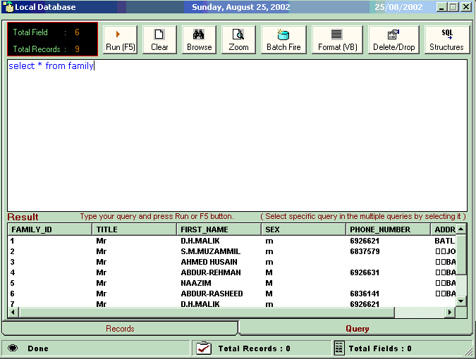



## Database Tracker

### Description

You can connect three databases at one point of time through this application i.e. SQL Server, MySQL and Ms Access. Simultaneously, you can get the references of all tables and connect with DSN too. Adding to this, there is one big utility that changes unformatted SQL queries in two formats [For VB Formatting and For SQL Formatting].

Much more trendy feature that are unanimously claimed by anyone and don’t forget to vote for me.
 
### More Info
 

             |
---                |---
**Submitted On**   |2002-10-28 20:03:16
**By**             |[Deepak Sharma](https://github.com/Planet-Source-Code/PSCIndex/blob/master/ByAuthor/deepak-sharma.md)
**Level**          |Advanced
**User Rating**    |4.7 (33 globes from 7 users)
**Compatibility**  |VB 6\.0
**Category**       |[Databases/ Data Access/ DAO/ ADO](https://github.com/Planet-Source-Code/PSCIndex/blob/master/ByCategory/databases-data-access-dao-ado__1-6.md)
**World**          |[Visual Basic](https://github.com/Planet-Source-Code/PSCIndex/blob/master/ByWorld/visual-basic.md)
**Archive File**   |[Database\_T14972411142002\.zip](https://github.com/Planet-Source-Code/deepak-sharma-database-tracker__1-40718/archive/master.zip)

